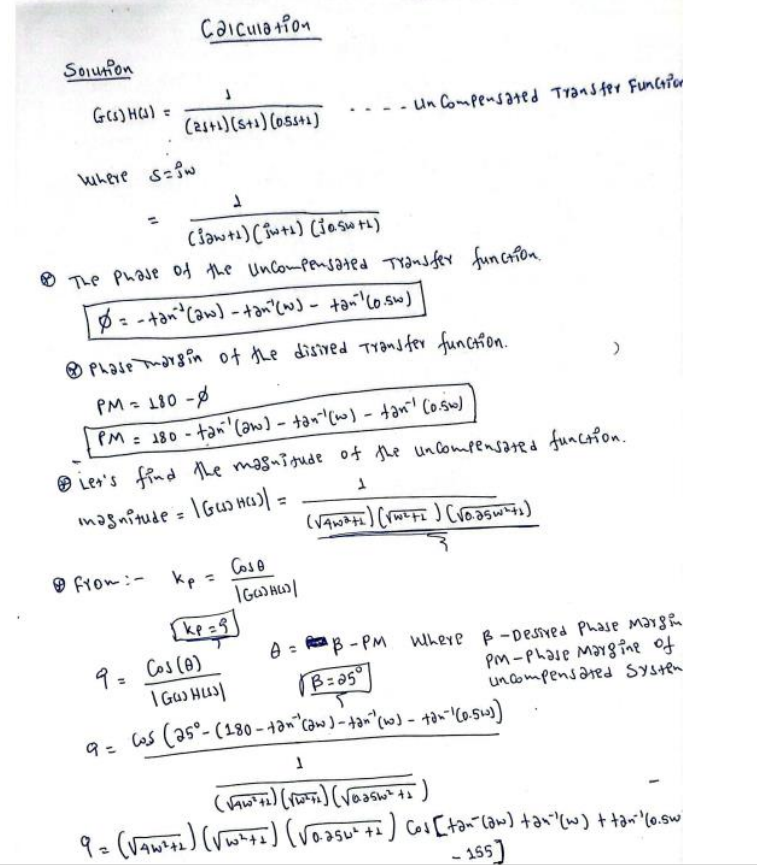
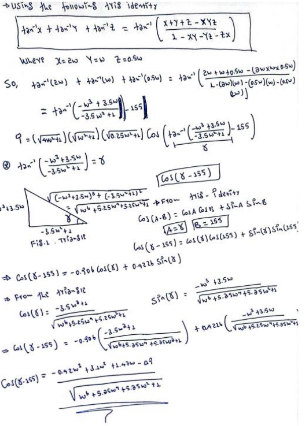
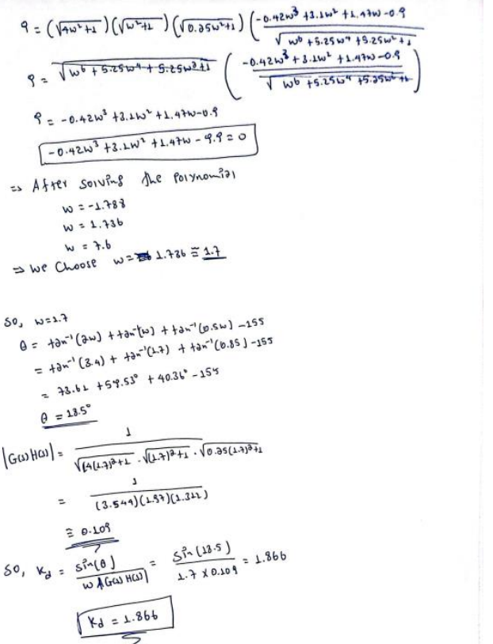

# Proportional Derivative Controller

## Introduction

- A PD (Proportional-Derivative) controller is a type of feedback controller commonly 
used in control systems. It combines proportional and derivative control actions to 
improve the system's response and stability. The PD controller calculates the control 
signal based on the error between the desired setpoint and the actual output, as 
well as the rate of change of the error.
o 𝑢(𝑡) = 𝐾𝑝𝑒(𝑡) + 𝐾𝑑
𝑑𝑒(𝑡)

𝑑𝑡

- The problem at hand involves the design of a P D controller for a system with a given forward-path transfer function. The objective is to design a controller that satisfies certain specifications, including a specific value for the proportional gain (KP) and a 
phase margin greater than 25°. The goal is to achieve stable and satisfactory system 
performance by appropriately designing the controller. The following sections will 
outline the design procedure, analyze the system's stability, calculate static error 
constants and steady-state errors, determine the range of possible proportional 
controller values, and simulate the overall system using SIMULINK.

# Given Problem 
The forward-path transfer function of a system is 
G(s)H(s) = 1 / (2s + 1) (s + 1) (0.5s + 1) 
(a) Design a P D controller such that the KP = 9, and the phase margin is greater than 25◦.
(b) Determine the static error constants and the corresponding steady state errors of the 
compensated system. 
(c) What is the range of the possible values of a proportional controller that can be designed 
for this system.
3
Design procedure
Finding Kd
• A PD controller can be represented as 
 C= Kp + Kd S ……. where Kp is the proportional constant and kd is the derivative constant
  

 

